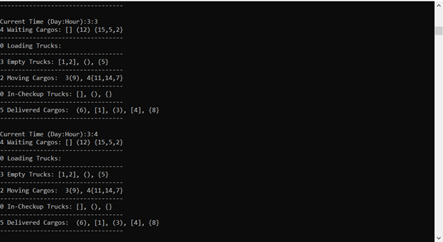

# 🚚 Shipping Company Cargo Delivery Simulation 📦

This project is a cargo delivery simulation program designed to automate the process of assigning cargos to trucks for a shipping company. It aims to optimize the delivery process by considering factors such as cargo type, truck availability, and priority criteria. The program utilizes data structures and algorithms to efficiently assign cargos, simulate the delivery process, and provide statistics for process improvement.

## Examples of Items to be Delivered 📦

The cargos in the simulation can be categorized into three types:

1. VIP Cargos 🌟:
   - These are high-priority cargos that need to be assigned first.
   - Examples: Urgent medical supplies, time-sensitive documents.

2. Special Cargos 🚀:
   - These are cargos that require specialized trucks for transportation.
   - Examples: Frozen goods, hazardous materials.

3. Normal Cargos 📦:
   - These are regular cargos that do not have any specific requirements.
   - Examples: General merchandise, household items.

## Types of Trucks 🚛

The simulation includes three types of trucks:

1. VIP Trucks (VT) 🏆:
   - These trucks are specifically used for VIP cargos.
   - They prioritize the delivery of high-priority cargos.

2. Special Trucks (ST) 🚚:
   - These trucks are equipped to handle special cargos.
   - Examples: Frozen goods, hazardous materials.

3. Normal Trucks (NT) 🚛:
   - These trucks are general-purpose and can handle a variety of cargos.
   - Examples: General merchandise, household items.

The program takes into account the type of truck available and assigns the appropriate cargos based on the cargo type and truck availability.

Please refer to the documentation or source code for further details on the simulation algorithm and implementation. 📖
## Data Structures Used in the Project

In this project, various data structures were utilized to optimize the cargo delivery simulation. These data structures were implemented as templates and coded from scratch. The following data structures were employed:

- **Queue**: Implemented as a FIFO (first in, first out) data structure, the queue was used for the event list. This allows for efficient execution of events in their order of insertion.

- **Priority Queue implemented with a Heap Tree**: The priority queue was used to prioritize VIP cargos based on specific criteria. The implementation using a heap tree ensures efficient insertion and retrieval of the highest-priority element.

- **General Linked List**: A linked list data structure was employed for various purposes throughout the project. It offers flexibility in managing and manipulating data, enabling efficient insertion, deletion, and traversal operations.

For more detailed information on the usage of each data structure for specific objects and the rationale behind their selection, please refer to the documentation available in the [GitHub repository](https://github.com/SalahAbotaleb/Shiping-Company-Management-System/blob/master/DataStructures.pdf). The documentation provides insights into the design choices and the advantages of utilizing particular data structures for different components of the project.
# 📸 Images from the Application running

*The beggining of the application where user enters the input file name*

*In the middle of the simulation execution*
